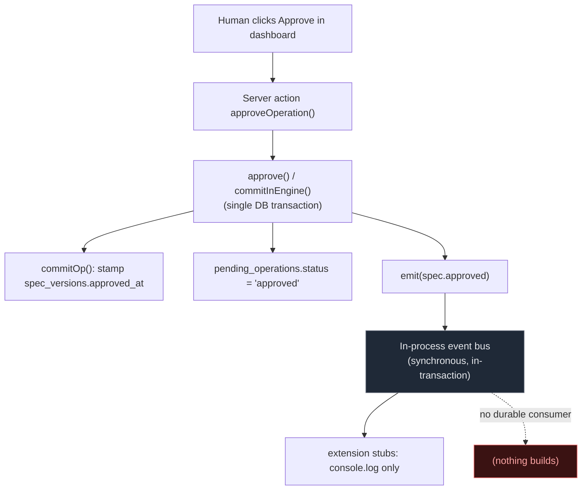
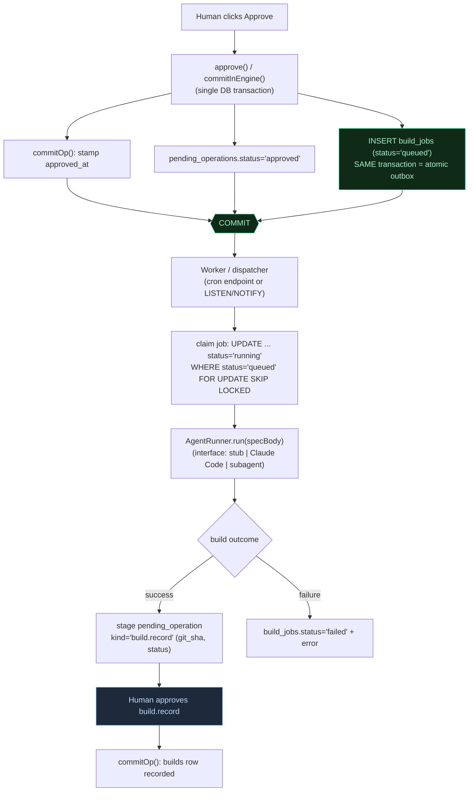
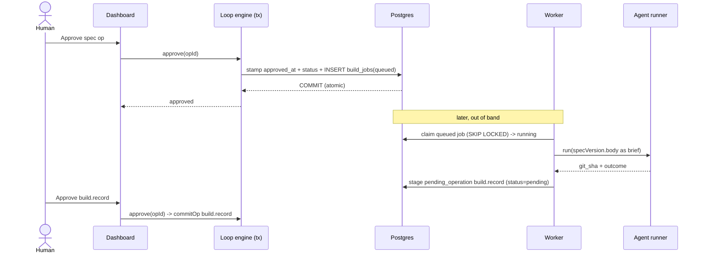

# PRD — Agent Build Execution

**Status:** Draft · **Owner:** PLO · **Last updated:** 2026-10-06
**Related:** `docs/architecture.md`, `AGENTS.md`, `src/lib/loop/engine.ts`, `src/lib/pending-operations/index.ts`

---

## 1. Summary

When a human approves a staged agent operation in the UI (for example, approving
a drafted spec), PLO changes the **record** but nothing **builds**. This PRD
defines how an approval becomes a durable trigger that an agent can act on right
away — building against the approved spec — while preserving every existing loop
invariant: single write path, human-approves-by-risk-tier, immutable approved
specs, and RLS tenancy.

The core principle is unchanged: **agents amplify execution; they never merge
high-risk change.** The agent builds, then stages its result back as a new
pending operation for a human to approve.

---

## 2. Problem

### 2.1 What happens today

Approving a pending operation runs `approve()` → `commitInEngine()` in
`src/lib/pending-operations/index.ts`, which inside a single transaction:

1. `commitOp(tx, …)` — writes the loop-state change (e.g. stamps
   `spec_versions.approved_at`).
2. Flips `pending_operations.status = 'approved'`.
3. `emit({ type: "spec.approved", … })` on the in-process event bus.

That `emit` is the only seam where a build could start. But the bus
(`src/lib/events/bus.ts`) is **in-process and synchronous**, its only
subscribers are logging stubs in `src/extensions/general/*`, and critically it
fires **inside the transaction, before commit**. So today:

- Approval changes the record; no build is triggered.
- The event is ephemeral — it is forgotten when the request ends.
- Any subscriber that tried to launch a build synchronously would act on
  state that has not committed yet (and could be rolled back).

### 2.2 Why it matters

The whole premise of PLO is that humans and agents share one system of record
and the loop (idea → spec → build → measure → learn → decide) actually turns.
Right now the loop **stalls at "build"**: a human can approve executable intent,
but there is no mechanism to hand that intent to an agent and get a build back.

---

## 3. Goals / Non-goals

### Goals
- Approving a buildable spec **durably enqueues** exactly one build job,
  atomically with the approval.
- A worker picks up the job and invokes an **agent runner** with the approved
  spec body as the brief.
- The agent **reports back** by staging a `build.record` pending operation
  (git SHA + status) — a human approves it. No auto-merge.
- Every existing invariant holds: single write path, risk-tiered human approval,
  immutable approved specs, RLS, core-never-imports-extensions.
- Idempotent: a double-click or retry never double-builds.

### Non-goals (v1)
- Running untrusted code in production / unsupervised deploys.
- A specific agent vendor — the runner is behind an interface; the first
  implementation may be a stub or Claude Code.
- Multi-step build orchestration / DAGs. One approval → one build job.
- Real-time streaming of agent logs to the UI (polling is fine for v1).

---

## 4. Current-state architecture



**Takeaway:** the trigger exists (`spec.approved`) but has no durable
consequence. The event dies with the request, and it fires pre-commit.

---

## 5. Proposed architecture

Introduce a **transactional outbox** (`build_jobs`) written in the same
transaction as the approval, a **worker** that claims jobs with
`FOR UPDATE SKIP LOCKED`, and an **agent runner** behind an interface. The agent
reports back through the existing `build.record` pending-operation path.



### 5.1 Sequence



---

## 6. Data model

New table, same RLS pattern as every other tenant table:

```sql
create table build_jobs (
  id            uuid primary key default gen_random_uuid(),
  workspace_id  uuid not null references workspaces(id) on delete cascade,
  spec_id       uuid not null references specs(id) on delete cascade,
  spec_version  int  not null,
  status        text not null default 'queued',   -- queued|running|succeeded|failed
  git_sha       text,
  attempts      int  not null default 0,
  error         text,
  claimed_at    timestamptz,
  finished_at   timestamptz,
  created_at    timestamptz not null default now(),
  unique (spec_id, spec_version)                   -- idempotency: one build per approved version
);
alter table build_jobs enable row level security;
-- membership policy + plo_app grants, as per migration 002.
```

- **Idempotency** is the `unique (spec_id, spec_version)` constraint: approving
  the same version twice (double-click, retry) cannot create a second job.
- The outbox insert lives in `commitOp`'s `spec.approve` case, only when the
  approved spec body is "buildable" (has acceptance criteria / a build marker).

---

## 7. Interfaces

### 7.1 Engine change (in-transaction outbox)
In `src/lib/loop/engine.ts`, `spec.approve` case, after stamping `approved_at`:

```ts
if (isBuildable(approvedBody)) {
  await tx.query(
    `insert into build_jobs (workspace_id, spec_id, spec_version, status)
     values ($1,$2,$3,'queued')
     on conflict (spec_id, spec_version) do nothing`,
    [p.workspace_id, p.spec_id, p.version]
  );
}
```

### 7.2 Worker (claim loop)
A cron endpoint (`/api/webhooks/loop-build-run`, mirroring the existing
`loop-metric-pull` cron in `vercel.json`) or a standalone process:

```sql
update build_jobs set status='running', claimed_at=now(), attempts=attempts+1
where id = (
  select id from build_jobs
  where status='queued'
  order by created_at
  for update skip locked
  limit 1
) returning *;
```

`SKIP LOCKED` lets multiple workers run without double-claiming.

### 7.3 Agent runner (behind an interface)
```ts
interface AgentRunner {
  run(input: { specId: string; version: number; body: SpecBody }):
    Promise<{ ok: boolean; gitSha?: string; error?: string }>;
}
```
First implementation: a **stub** that returns a fake SHA (so the whole pipeline
is real and tested before a live agent is wired). Later: Claude Code CLI or a
Hermes subagent.

### 7.4 Report-back (no auto-merge)
On success the worker does NOT write to `builds` directly. It stages:
`propose(kind='build.record', payload={ spec_id, git_sha, status:'shipped' })`,
which a human approves via the existing Approve button. The loop closes through
the same gate it opened.

---

## 8. Risks & mitigations

| Risk | Mitigation |
|------|-----------|
| Build fires on uncommitted state | Outbox row written **in the approval tx**; worker only sees committed `queued` rows. |
| Double-build on double-click/retry | `unique (spec_id, spec_version)` + `on conflict do nothing`. |
| Two workers grab the same job | `FOR UPDATE SKIP LOCKED` claim. |
| Agent auto-merges high-risk change | Agent can only **stage** `build.record`; a human approves. Invariant preserved. |
| Stuck `running` jobs (worker crash) | Reaper: re-queue `running` jobs older than N minutes, bounded by `attempts`. |
| Untrusted code execution | v1 runner is sandboxed/stubbed; production deploy stays a separate, supervised step (non-goal). |
| RLS bypass | `build_jobs` gets the standard membership policy; worker uses the service role only to claim, never to cross tenants. |

---

## 9. Success metrics

- Approving a buildable spec creates **exactly one** `queued` job (proven by test).
- Worker claims a job **idempotently** under concurrency (proven by a
  `SKIP LOCKED` test with two claimers).
- A completed build surfaces as a **pending `build.record`** a human can approve.
- Zero loop-invariant regressions: `loop-verify` stays green.

---

## 10. Rollout plan

1. **Migration** — `build_jobs` table + RLS + grants.
2. **Engine** — in-tx outbox insert in `spec.approve` (+ `isBuildable`).
3. **Worker** — claim endpoint/process with `SKIP LOCKED`; `AgentRunner` stub.
4. **Report-back** — worker stages `build.record` on success.
5. **Tests** (`tests/pg/`) — enqueue-on-approve, idempotency, concurrent claim,
   report-back path.
6. **UI** (optional) — a "Builds" section showing job status, polling.
7. **Live runner** — swap the stub for Claude Code / a subagent behind the same
   interface.

Each step ships as its own PR through the `loop-verify` CI gate.

---

## 11. Open questions

- **What makes a spec "buildable"?** A convention in the body
  (`body.build = true` / presence of `tests`), or a separate risk/label? Default
  proposal: build when `body.acceptance` is non-empty and `body.build !== false`.
- **Where does the worker run?** Vercel cron (simplest, matches existing
  `loop-metric-pull`) vs a long-lived process with `LISTEN/NOTIFY` (lower
  latency). Proposal: start with cron, add `NOTIFY` later — the bus.ts comment
  already anticipates this.
- **Build artifacts / logs** — store a pointer (URL) on `build_jobs`, or a
  separate `build_logs` table? Out of scope for v1; store `git_sha` + `error`.
